# goit-rdb-fp


## 1. Завантажте дані:

```mysql
-- Створіть схему pandemic у базі даних за допомогою SQL-команди.
CREATE SCHEMA IF NOT EXISTS pandemic;

-- p1.2
-- Оберіть її як схему за замовчуванням за допомогою SQL-команди.
USE pandemic;
```

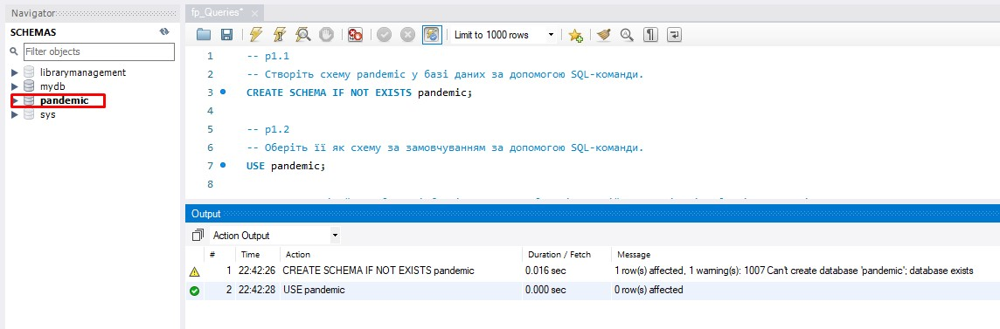

## 2. Нормалізуйте таблицю 

```mysql
-- p2. Нормалізуйте таблицю infectious_cases. Збережіть у цій же схемі дві таблиці з нормалізованими даними.
-- p2.1 видалення таблиць,якщо існують
DROP TABLE IF EXISTS entity;
DROP TABLE IF EXISTS infectious_cases_normal;

-- p2.2 Створення і перенос даних в створену таблицю entity
CREATE TABLE entity(
	id INT PRIMARY KEY AUTO_INCREMENT,
	code VARCHAR(8),
	country VARCHAR(64) NOT NULL UNIQUE
);

INSERT INTO entity (code, country)
SELECT DISTINCT code, entity FROM infectious_cases;

-- p2.3 Створення і перенос даних в створену таблицю infectious_cases_normal
-- Копіювання таблиці infectious_cases в нову: infectious_cases_normal
CREATE TABLE infectious_cases_normal 
AS SELECT * FROM infectious_cases;

-- Створення нових колонок
ALTER TABLE infectious_cases_normal
ADD id INT PRIMARY KEY AUTO_INCREMENT FIRST,
ADD entity_id INT AFTER id,
ADD CONSTRAINT fk_entity_id FOREIGN KEY (entity_id) REFERENCES entity(id);

-- Заповнення колонки country_id 
SET SQL_SAFE_UPDATES = 0;
UPDATE infectious_cases_normal i, entity e  
SET i.entity_id = e.id 
WHERE e.code = i.code AND e.country = i.Entity;
SET SQL_SAFE_UPDATES = 1;

-- Видалення непотрібних колонок
ALTER TABLE infectious_cases_normal
DROP COLUMN entity,
DROP COLUMN code;
```
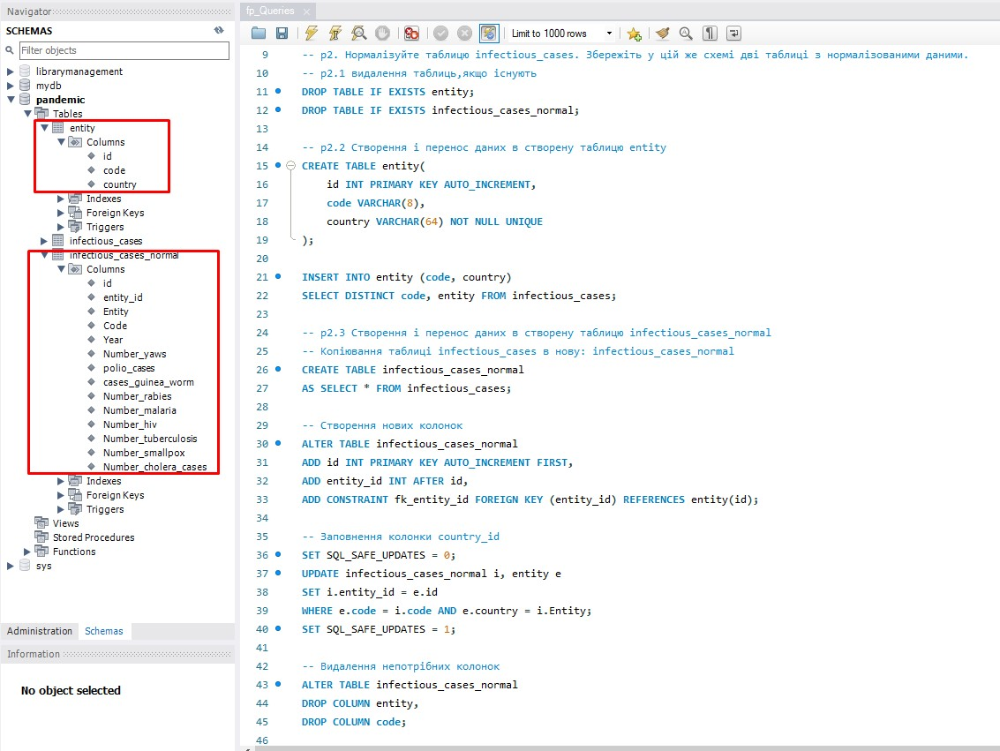
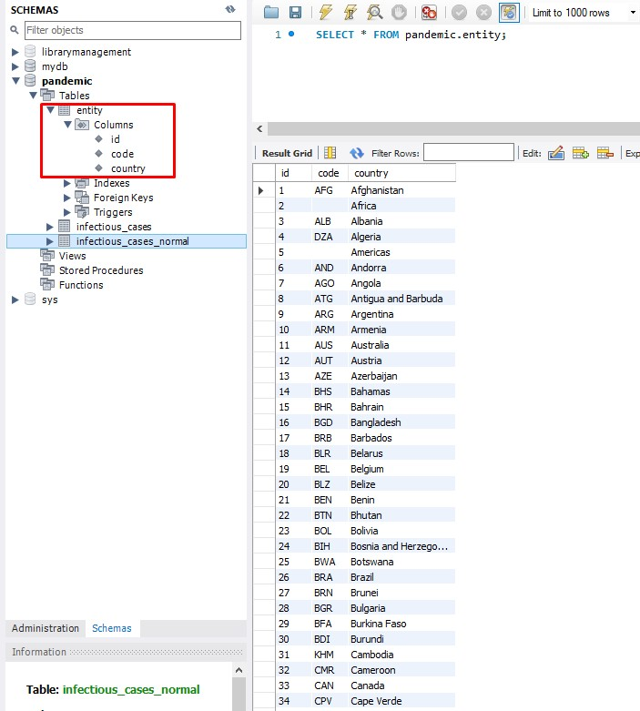
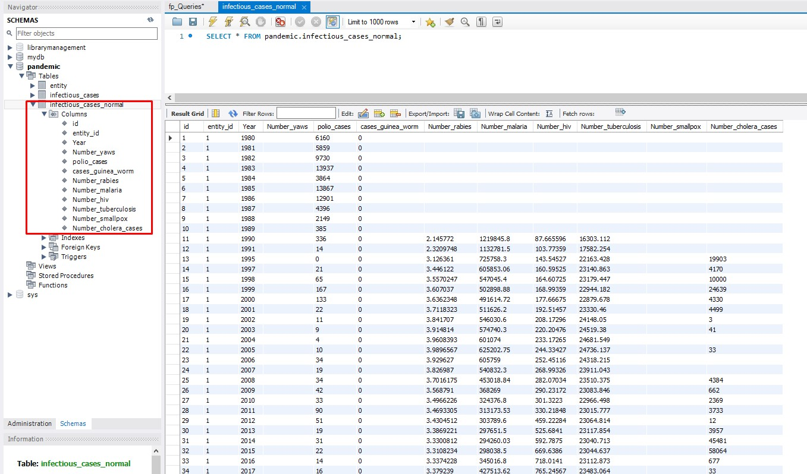
## 3. Проаналізуйте дані:

```mysql
- p3. Проаналізуйте дані:
-- p3.1 Для кожної унікальної комбінації Entity та Code або їх id порахуйте середнє, мінімальне, максимальне значення та суму для атрибута Number_rabies.
SELECT 
	id, 
    MAX(number_rabies) AS max_value, 
    MIN(number_rabies) AS min_value, 
    AVG(number_rabies) AS avg_value,
    SUM(number_rabies) AS sum_value
FROM infectious_cases_normal
WHERE number_rabies IS NOT NULL AND number_rabies <> ''
GROUP BY id;

-- p3.2 Результат відсортуйте за порахованим середнім значенням у порядку спадання.
SELECT 
	id, 
    MAX(number_rabies) AS max_value, 
    MIN(number_rabies) AS min_value, 
    AVG(number_rabies) AS avg_value,
    SUM(number_rabies) AS sum_value 
FROM infectious_cases_normal
WHERE number_rabies IS NOT NULL AND number_rabies <> ''
GROUP BY id
ORDER BY avg_value DESC;

-- p3.3 Оберіть тільки 10 рядків для виведення на екран.
SELECT 
	id, 
    MAX(number_rabies) AS max_value, 
    MIN(number_rabies) AS min_value, 
    AVG(number_rabies) AS avg_value,
    SUM(number_rabies) AS sum_value 
FROM infectious_cases_normal
WHERE number_rabies IS NOT NULL AND number_rabies <> ''
GROUP BY id
ORDER BY avg_value DESC
LIMIT 10;

```

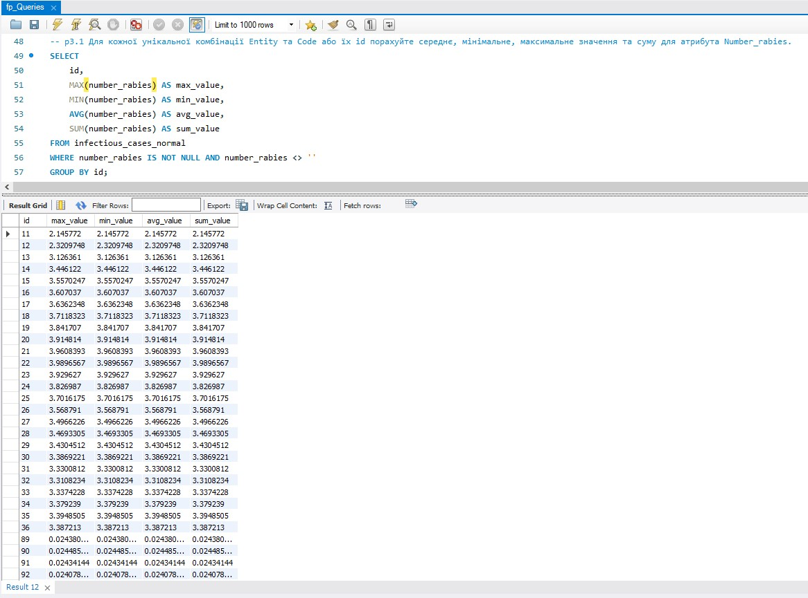
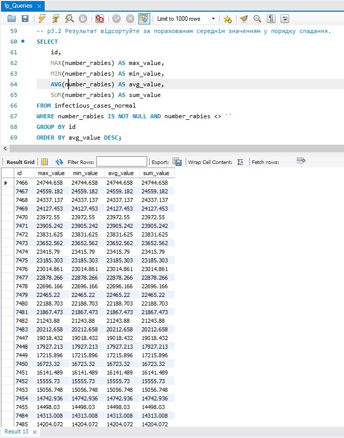
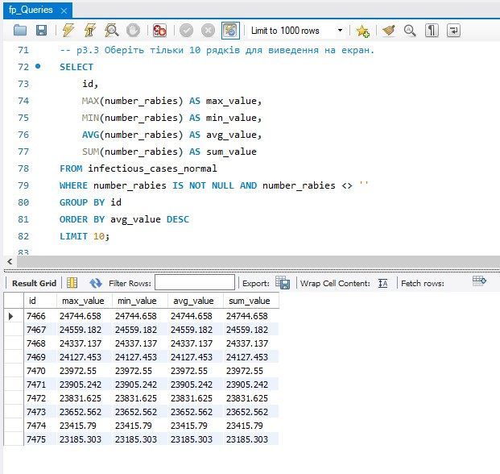

## 4. Побудуйте колонку різниці в роках.

```mysql
-- p4. Побудуйте колонку різниці в роках.
-- Для оригінальної або нормованої таблиці для колонки Year побудуйте з використанням вбудованих SQL-функцій:
-- p4.1 атрибут, що створює дату першого січня відповідного року
SELECT 
    id,
    year,
    CONCAT(year, '-01-01') AS year_start_date
FROM infectious_cases_normal;

-- p4.2 атрибут, що дорівнює поточній даті,
SELECT 
    id,
    year,
    CURDATE() AS cur_date
FROM 
    infectious_cases_normal;
    
-- p4.3 атрибут, що дорівнює різниці в роках двох вищезгаданих колонок.
SELECT 
    id,
    year,
    CONCAT(year, '-01-01') AS year_start_date,
    CURDATE() AS cur_date,
   TIMESTAMPDIFF(YEAR, CONCAT(year, '-01-01'), CURDATE()) AS year_diff
FROM 
    infectious_cases_normal;
```

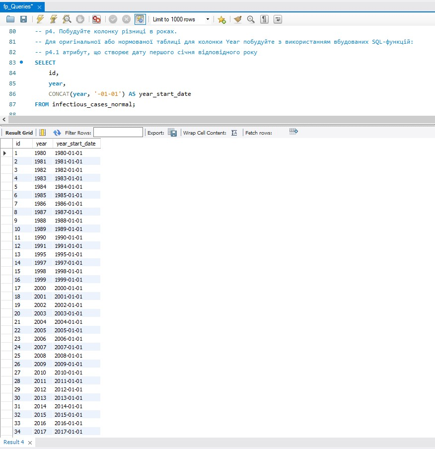
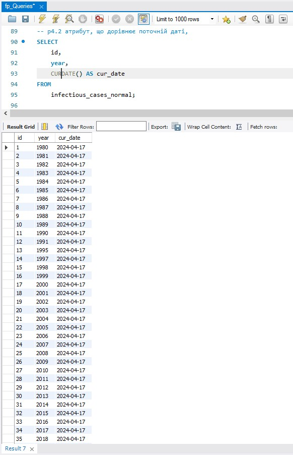
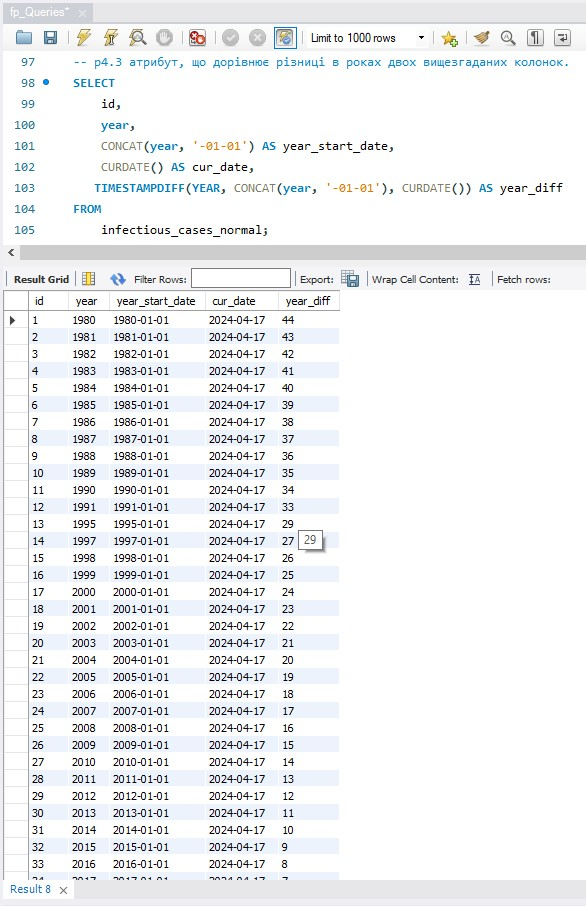
## 5. Побудуйте власну функцію


```mysql
-- p5. Побудуйте власну функцію.
-- Створіть і використайте функцію, що будує такий же атрибут, як і в попередньому завданні: 
-- функція має приймати на вхід значення року, а повертати різницю в роках між поточною датою та датою, створеною з атрибута року (1996 рік → ‘1996-01-01’).
drop function if exists CalcYearDiff;
DELIMITER //
CREATE FUNCTION CalcYearDiff(input_year INT)
RETURNS INT
NO SQL
BEGIN
    DECLARE year_start DATE;
    DECLARE cur_date DATE;
    DECLARE year_diff INT;

    SET year_start = CONCAT(input_year, '-01-01');
    SET cur_date = CURDATE();
    SET year_diff = TIMESTAMPDIFF(YEAR, year_start, cur_date);

    RETURN year_diff;
END//
DELIMITER ;

SELECT 
    id,
    year,
    CURDATE() AS cur_date,
    CalcYearDiff(Year) AS year_diff
FROM 
    infectious_cases_normal;
```

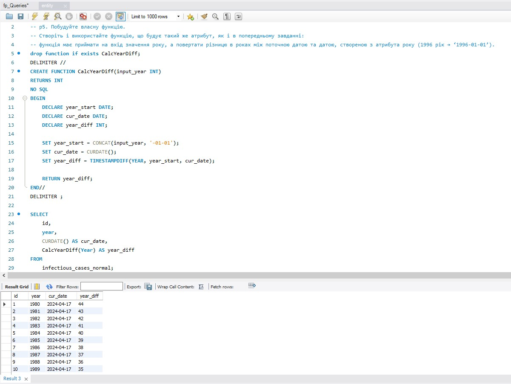